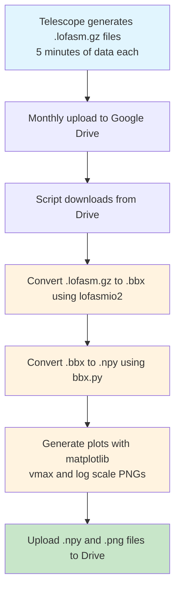

# LoFASM Processing
___
Here lies the code used in the Summer of 2025 by Hillsdale students processing 30 TB of telescope data from LoFASM V. The general data pipeline is as follows:

## Usage

If you want to use this script, you'll need:
- Python
- Everything in `requirements.txt`
- An rclone config or two with unlimited storage space
- The `lofasm2bbx` binary compiled for your machine (download [lofasmio2](https://github.com/ldartez/lofasmio2), `mkdir build && cd build`, `cmake ..`, and `make`)

The `server.py` version is designed to use as many resources as are available, have a small storage footprint, and run on it's own for weeks without interuption. We run it on the Hillsdale server. While most of the code should be the same, `local.py` is for running on your local computer.

## AI

About 4000 png files are produced every hour; we've begun to train an AI model to sort through the pngs looking for Solar Radio Bursts. 

## Additional Info

This code is all designed for Mac; if you want to run on Windows you will need to run it on a Docker VM which takes a much longer time to process files. 

